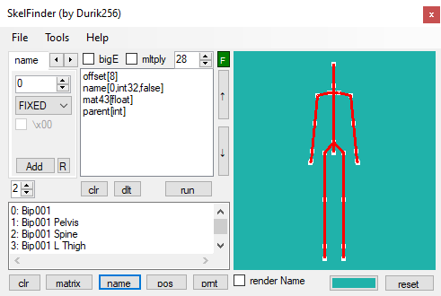

# SkelFinder
Tool for finding skeletons in binary files. 

##ToolStripMenu: 
###File: 
[Open...] - open any file for finding skel.
[Eport] - export cur skel to [.SkelFinder], collada [.dae], valve [.smd].
[Exit] - close Form.
###Tools: 
[TextBox Mode] - activate TextBox mode.(full template editing)
[ListBox Mode] - activate ListBox mode.(adding and editing cmd using the UI)
[list <-> text] - copy all cmd from not active mode in active mode.(the inactive template will be cleared)
[open temp.txt] - loads cmd(and params) from temp file.
[save temp.txt] - save cmd(and params) in temp file from active mode.
[save BMP] - save 3D preview to bmp picture.
###CmdTabPages: 
####name - will read the string and assigned as the name of the bone. 
[NumericUpDown] - string length if fixed. (or '-1' to read all characters up to the first null byte)
[DropDown] - to select the mode. (fixed or read the length value before the string)
[CheckBox][\x00] - indicate if there is a null byte at the end of the string.
####rotation - will read a rotation with the specified type and auto converted to a 4x4 matrix for the bone. 
[DropDown] - rotation type (Mat43, Mat44, Quat, Euler[rad,deg])
[DropDown] - value type for cur rotation.
if selected rotation UlerAngles: [i]DropDown[/i] - transpose value (xyz, yxz, e.t.c)
[CheckBox][transpose] - Transposes the rows and columns of a matrix.(or quat)
[CheckBox][inverse/normalize] - Inverts the specified matrix. (or normalize for quat)
####position - will read a vector3 with the specified type, and set the position in the bone matrix. 
[DropDown] - value type.
####parent - will read parent, and set in the bone. 
[DropDown] - to select the mode. (string or integer)
if a string, then the rest of the parameters are the same as for the command "name"
####seek - skip specified number of bytes. 
[DropDown] - to select the mode. (fixed or read the value from file)
[CheckBox][mul] - multiply the read value by the specified value.
[NumericUpDown] - the value by which the read value will be multiplied.
####offset - the new position in the current stream(begin).divides the template into cycles. 
FOR ALL CMD:  
[Button][Add] - add current command to template.
[Button][R] - overwrite the selected command in the template with the current command. (for editing, only for ListBox mode)
###Template: 
[CheckBox][bigE] - whether to use big Endian when reading.
[CheckBox][mltply] - multiply child bones by parent. (from local to world space)
[NumericUpDown] - specify how many bones to read from the file.
[Button][F] - open file. (red if no file is open, and green when open)
[ListBox]/[TextBox] - template entry field.
[Button][↑] - move selected cmd up.(only for ListBox mode)
[Button][↓] - move selected cmd down.(only for ListBox mode)
[Button][clr] - clear all cmd from active(Template) mode.
[Button][del] - remove selected cmd.(only for ListBox mode)
[Button][run] - read bones from a file using the active template and the specified parameters.
###Debug: 
[NumericUpDown] - number of decimal places when printing.
[TextBox] - bebug entry field.
[Button][clr]/[matrix]/[name]/[pos]/[prnt] - printing information.
###3D View: 
[PictureBox] - draw 3d skeleton.
[CheckBox][render name] - render name in 3d view.
[Button][color] - change cbackground color.
[Button][reset] - reset 3d view.(or click middle mouse button)
[Mouse] - LKM DOWN AND MOVE for rotation. whell for zoom.
[i]warning: "if the position goes beyond the boundaries of the file during reading, it will return those bones that were read before the error, also the multiplication will not be performed(if use), and the parent will not be converted to an integer from string(if use)[/i]
